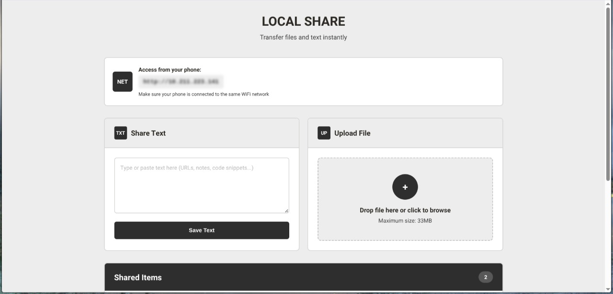

# Local Share

A clean, minimalist local file and text sharing application for seamless transfers between devices on the same network.

<div align="center">
  
  <p><em>Main interface showing text sharing and file upload</em></p>
</div>

## Overview

Local Share allows you to quickly transfer files and text between your devices without any cloud services. Simply connect your devices to the same WiFi network and start sharing.

### Key Features

-   **File Transfer**: Upload and download files up to 33MB with drag & drop support
-   **Text Sharing**: Quick text note sharing with one-click copy
-   **Local Network**: Privacy-focused - everything stays on your network
-   **No Dependencies**: Pure HTML, CSS, and JavaScript - no external libraries
-   **Clean Design**: Minimalist interface with earthy color palette

## Installation

### Requirements

-   PHP >= 8.1
-   Composer
-   Laravel >= 12.x

### Setup Steps

1. **Clone the repository**

```bash
git clone <repository-url>
cd local-share
```

2. **Install dependencies**

```bash
composer install
```

3. **Environment setup**

```bash
cp .env.example .env
php artisan key:generate
```

4. **Configure storage**

```bash
php artisan storage:link
chmod -R 775 storage
```

5. **Start the server**

```bash
php artisan serve --host=0.0.0.0 --port=8000
```

6. **Access the application**
    - Open browser on your computer: `http://localhost:8000`
    - On your phone (same WiFi): `http://YOUR_LOCAL_IP:8000`
    - Your local IP will be displayed in the network banner

## Quick Start

1. Start the Laravel server
2. Note your local IP from the network banner
3. Connect your phone to the same WiFi
4. Access the IP address from your phone's browser
5. Start sharing files and text!

---

**Note**: This application is designed for local network use only. Do not expose to public internet without proper security measures.
